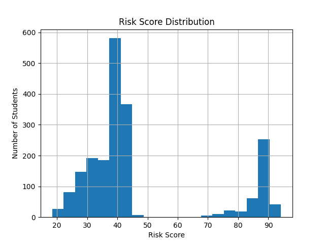

# 🎓 An Early Behavioural Drift Detection System for Proactive Academic Intervention (Problem Statement 1)
  
<p align="center">
  
  
  
  
  
</p>

---

# 🚨 Problem Statement

### The Hidden Crisis in Higher Education

Academic failure is rarely sudden.  
It is preceded by **behavioural instability**.

Yet, most institutions rely on:

- Semester-end grades  
- Missed exams  
- Performance decline  

By the time those indicators appear,  
**burnout has already progressed.**

Built for the **Behavioural Analytics Hackathon – Early Detection of Student Burnout & Dropout Risk**.

---

# 🎥 Live Dashboard Demo

<p align="center">
  <a href="https://drive.google.com/file/d/13mUupqK3NdZF5xCMJQCRvCE9jbddW07-/view?usp=sharing" target="_blank">
    
  </a>
</p>

---
# 🧠 Core Innovation

We model **behavioural instability over time**, not static engagement.

Instead of “low attendance”, we detect:

- 📉 Attendance decline patterns  
- 📉 LMS login drop trends  
- 📈 Assignment delay escalation  
- 😊 Sentiment deterioration  
- 📊 Behavioural volatility  

This enables **early-stage burnout detection before academic collapse**.

---

# 📊 Risk Analytics Engine

## 📌 Risk Segmentation

<p align="center">
  
</p>

---

## 📈 Risk Score Distribution

<p align="center">
  
</p>

---

## 📘 Behaviour Profile Risk Comparison

<p align="center">
  
</p>

---

# 🔍 Explainable AI (SHAP Integrated)

### 🌍 Global Behaviour Drivers

<p align="center">
  
</p>

---

### 👤 Individual Student Explanation

<p align="center">
  
</p>

Each student receives:

- Feature-level contribution breakdown  
- Transparent reasoning behind risk prediction  
- No black-box decisions  

---

### 🏗 System Architecture

```
Synthetic Behaviour Simulation
        ↓
Feature Engineering (Drift Metrics)
        ↓
Burnout Classification Model
        ↓
Dropout Probability Model
        ↓
Composite Risk Engine (0–100)
        ↓
SHAP Explainability Layer
        ↓
Intervention Recommendation Engine
        ↓
Interactive Dashboard
```

---

# 🤖 Model Overview

| Component | Description |
|-----------|------------|
| Burnout Classifier | Multi-class Random Forest |
| Dropout Model | Binary Probability Model |
| Risk Score | Weighted Composite Index (0–100) |
| Explainability | SHAP |
| Dashboard | Streamlit |

**Burnout Classification Accuracy: 90%**

---

# 🗂 Synthetic Dataset Disclosure (Mandatory)

## 📌 Dataset Type
**Synthetic Behavioural Dataset**

## ❓ Why Synthetic?

- No publicly available real-world behavioural burnout dataset exists  
- Student behavioural and mental health data is highly sensitive  
- Universities do not release LMS + sentiment behavioural logs  

Therefore, a controlled synthetic dataset was generated to simulate realistic academic behaviour patterns.

---

## ⚙️ How the Dataset Was Generated

### 👥 Scale
- 2000 Students  
- 16 Academic Weeks  
- Weekly behavioural logs  

Total behavioural records:  
`2000 students × 16 weeks = 32,000 time-series entries`

---

### 🧩 Behavioural Archetypes Simulated

| Profile Type | Behaviour Pattern |
|--------------|------------------|
| Consistent Performer | Stable activity across weeks |
| Gradual Burnout | Slow decline in attendance & engagement |
| Sudden Disengagement | Normal early activity → sudden crash |
| Chronic Low Engagement | Persistently low engagement |

---

### 📐 Generation Logic

Each student is assigned:

1. **Baseline Behaviour (Weeks 1–4)**
   - Stable attendance
   - Stable LMS logins
   - Normal submission delay
   - Neutral sentiment

2. **Behavioural Drift (Weeks 5–16)**
   - Gradual linear decline (burnout profile)
   - Sudden exponential drop (disengagement)
   - Persistent low baseline (chronic)
   - Gaussian noise added for realism

3. **Random Noise Injection**
   - Normal distribution noise
   - Variance spikes
   - Irregular fluctuations

This ensures data is not linearly predictable and simulates real behavioural irregularities.

---

## 📊 Feature Description

| Feature | Description |
|----------|-------------|
| `lms_logins` | Weekly LMS login frequency |
| `attendance` | Weekly attendance percentage |
| `submission_delay` | Avg assignment delay (hours) |
| `sentiment_score` | Sentiment polarity (-1 to +1) |
| `activity_variance` | Weekly behavioural volatility |
| `login_drop_pct` | Percentage decline in LMS usage |
| `attendance_drop_pct` | Attendance decline rate |
| `delay_increase_pct` | Growth rate in submission delay |
| `burnout_label` | Low / Medium / High |
| `dropout_label` | Binary (0/1) |

---


# 🩺 Intervention Engine

| Risk Level | Action |
|------------|--------|
| 🟢 Low | Monitor |
| 🟡 Medium | Advisor Outreach |
| 🔴 High | Immediate Counselling + Academic Support |

Prediction → Actionable Intervention

---
## 📁 Project Structure

- **data/** – Raw synthetic dataset and engineered behavioural features  
- **src/** – Data generation, feature engineering, model training, risk scoring, and intervention logic  
- **app/** – Streamlit dashboard for visualization and student-level analysis  
- **README.md** – Project documentation  
- **requirements.txt** – Python dependencies
---

# ⚙️ Run Locally

```bash
pip install -r requirements.txt
streamlit run app/dashboard.py
```

---

# 🚀 Innovation Highlights

✔ Behavioural Drift Modelling  
✔ Early Burnout Detection  
✔ Composite Risk Scoring (0–100)  
✔ Explainable AI Integration  
✔ Intervention Mapping  
✔ Interactive Analytics Dashboard  

---

# 🎯 Practical Impact

This system enables institutions to:

- Detect behavioural instability early  
- Intervene before academic performance drops  
- Provide transparent AI-driven decisions  
- Integrate behavioural risk analytics into LMS systems  

---

<p align="center">
  <b>Behavioural Drift Modelling + Explainable AI + Decision Intelligence</b>
</p>

<p align="center">
  Built for Behavioural Analytics Hackathon 🚀
</p>
<p align="center">
  
</p>
